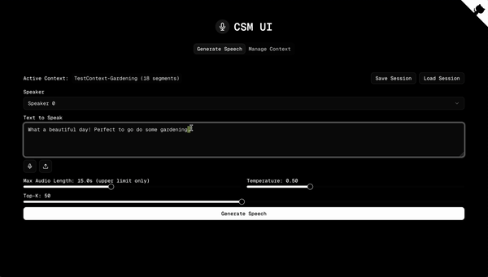
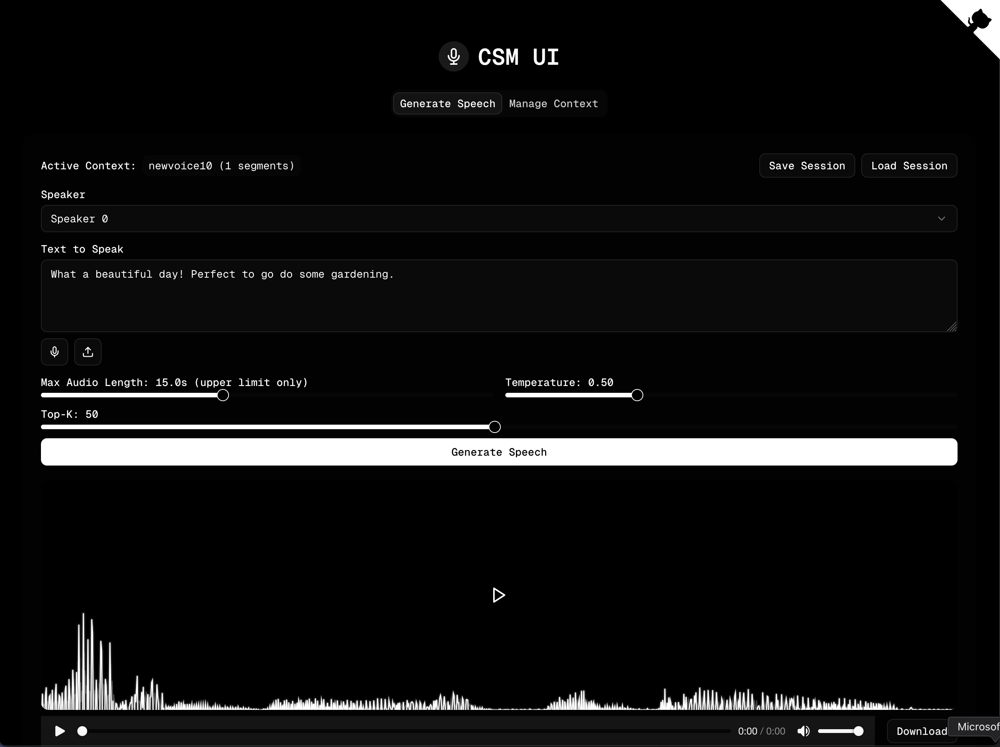
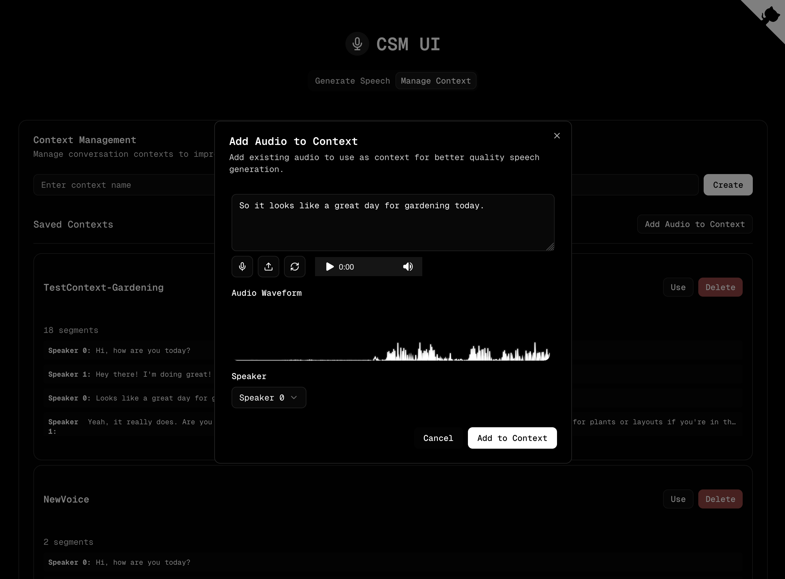

# CSM UI

A simple dark themed interface for testing and basic context management of the [CSM](https://github.com/SesameAILabs/CSM) base model by Sesame AI Labs.

## All credits and acknowledgements to SesameAILabs/CSM team. 🙏 
As they have mentioned, this is a base model and will require finetuning to get the consistent desired results. Hopefully this interface can get you started.

## Demo & Screenshots
<div align="center">
  
  <p><em>CSM UI in action - Text-to-speech generation with context management</em></p>
</div>

### Video Demo
[Watch the full demo video](csm-ui/docs/videos/csm-ui-demo.mp4)

### Screenshots
<div align="center">
  
  <p><em>Generating high-quality speech with customizable parameters</em></p>

  
  <p><em>Managing context for better voice consistency</em></p>
</div>


Please read their readme, FAQs, usage policy, misuse and abuse notice here: [SesameAILabs/CSM](https://github.com/SesameAILabs/CSM). A copy is also attached in this project's root - SesameAILabs_CSM-README.md

## Features
- Handy start script that will set up SesameAILabs/CSM python backend and csm-ui front end for you
- Test & Generate high-quality speech from text using CSM 1B
- Support for multiple speakers
- Save and apply Context management for improved coherence. Any generated audio is automatically transcribed and added to currently active session. See proper usage instructions below
- Text or audio inputs. Whisper model is used to automatically transcribe audio and add that as context
- Audio visualization with animated waveforms
- Add existing audio files to context for better quality
- Adjustable generation parameters
- Dark OLED-friendly theme with silver/white accents
- Save and load sessions with all settings and contexts
- Real-time progress indicators during generation


## Getting Started

### Prerequisites / Requirements

- Python 3.10 (or higher, but not tested)
- Node.js 18 or higher
- NPM 8 or higher
- Accept gated Huggingface models agreements with your hugging face account: 
   - https://huggingface.co/meta-llama/Llama-3.2-1B
   - https://huggingface.co/sesame/csm-1b

### Compatibility
- Mac ✅ (works on M3, M4, should work with other M based hardware, but for best performance use cuda enabled system)
- Windows (with cuda enabled) ✅
- Linux (with cuda enabled) ✅

### Installation

## Semi-Auto Easiest steps

1. Approve gated Huggingface models with your hugging face account.
2. Clone this repository:
```bash
git clone https://github.com/yourusername/csm-ui.git
cd csm-ui
```
3. Run the start script:
```bash
./start.sh
```

For Windows
```bash
./start.bat
```
   (It will set up everything and run the front end)

   Make sure you have already accepted huggingface agreements.
   Script uses uv (which it tries to install if not already exists).

   **IMPORTANT**: Be patient! The first run will install the required models along with the whisper model for transcriptions. This process can take a while depending on your internet speed. Go get a coffee.

4. If everything went well then app should be running at port 1885. 
   Load [http://localhost:1885](http://localhost:1885) and you should see CSM UI.

## Manual Install

(Python backend is pretty much the original code therefore please refer to [CSM](https://github.com/SesameAILabs/CSM) original authors' readme if any issues)

1. Clone this repository:
```bash
git clone https://github.com/yourusername/csm-ui.git
cd csm-ui
```

2. Set up the Python environment:
```bash
uv venv --python==3.10
source .venv/bin/activate  # On Windows, use .venv\Scripts\activate
uv pip install -r requirements.txt
```

3. Install the Node.js dependencies:
```bash
cd csm-ui
npm install
cd ..
```

### Running the Application

You can start both the web interface and the Python backend together using the provided script:

```bash
./start.sh
```

The script provides several options to customize how the application runs:

- Run in development mode: `./start.sh --dev`
- Run on a custom port: `./start.sh --port=8080`
- Combine options: `./start.sh --dev --port=8080`

By default, the script runs the application in production mode on port 1885.

For more details on using the start script, please see [Start Script Documentation](./docs/START_SCRIPT.md).

Or run them separately:

1. Start the Next.js development server:
```bash
cd csm-ui
npm run dev
```

2. In a separate terminal, make sure the Python environment is activated and the current directory is the root of the project.

The web interface will be available at [http://localhost:1885](http://localhost:1885).

## Usage

### Generating Speech

1. Select a speaker (0 or 1)
2. Enter the text you want to convert to speech or:
   - Record audio directly using the microphone button
   - Upload an audio file using the upload button (it will be automatically transcribed)
3. Adjust parameters as needed:
   - **Max Audio Length**: Maximum duration of the generated audio in seconds
   - **Temperature**: Controls the randomness of the generation (higher = more random)
   - **Top-K**: Number of most likely tokens to consider at each step
4. Click "Generate Speech" to create the audio

### Getting Consistent Voices

The base CSM model doesn't maintain a consistent voice by default. To get more consistent voices you need to tune the model. You can also use below steps for better audio with adding context:

1. **Always use the same speaker ID** (0 or 1) for a character/voice
2. **Use context effectively** - this is crucial for voice consistency
3. Create a dedicated context for each voice you want to maintain
4. Build up the context by generating several utterances with the same speaker ID
5. The more samples you add to the context with the same speaker ID, the more consistent the voice will become
6. Save your session to preserve your context for future use

Note that for production-quality consistent voices, the model would need to be fine-tuned on specific voice data.

### Managing Sessions

Sessions allow you to save and restore your generation settings and context for future use:

1. Set up your desired parameters, enter text, and select an active context
2. Click "Save Session" to store your current configuration
3. Give the session a descriptive name and save it
4. Later, click "Load Session" to view and restore any saved session
5. Your previous text, speaker, parameters, and active context will be restored

All sessions are stored locally in your browser and persist between visits.

### Managing Context

Context helps the model maintain a consistent style across multiple utterances:

1. Go to the "Manage Context" tab
2. Create a new context by entering a name and clicking "Create"
3. To add the context from generated speech:
   - Switch back to the "Generate Speech" tab and make sure your context is active
   - Generate speech, and the result will be added to the active context
4. To add existing audio files to context:
   - Select a context to make it active
   - Click "Add Audio to Context"
   - Either:
     - Upload an audio file using the upload button
     - Record audio directly using the microphone button
   - The audio will be automatically transcribed using Whisper
   - You can edit the transcription if needed
   - Select the speaker ID (use consistently for better results)
   - Click "Add to Context"
5. For subsequent generations, the model will use all previous utterances as context

This feature allows you to add high-quality audio recordings from external sources to use as context, which can significantly improve the quality and coherence of generated speech.

### Downloading Audio

Once audio is generated, you can download it by clicking the "Download" button.

## Appearance

The interface uses a sleek OLED-friendly dark theme with silver/white accents, designed for both aesthetics and readability. The waveform visualization appears in a silver/white color scheme that complements the overall design.

### Original Authors' Important Notes ([CSM](https://github.com/SesameAILabs/CSM))

## FAQ

**Does this model come with any voices?**

The model open-sourced here is a base generation model. It is capable of producing a variety of voices, but it has not been fine-tuned on any specific voice.

**Can I converse with the model?**

CSM is trained to be an audio generation model and not a general-purpose multimodal LLM. It cannot generate text. We suggest using a separate LLM for text generation.

**Does it support other languages?**

The model has some capacity for non-English languages due to data contamination in the training data, but it likely won't do well.

## Misuse and abuse ⚠️

This project provides a high-quality speech generation model for research and educational purposes. While we encourage responsible and ethical use, we **explicitly prohibit** the following:

- **Impersonation or Fraud**: Do not use this model to generate speech that mimics real individuals without their explicit consent.
- **Misinformation or Deception**: Do not use this model to create deceptive or misleading content, such as fake news or fraudulent calls.
- **Illegal or Harmful Activities**: Do not use this model for any illegal, harmful, or malicious purposes.

By using this model, you agree to comply with all applicable laws and ethical guidelines. We are **not responsible** for any misuse, and we strongly condemn unethical applications of this technology.

## Licensing

This project contains components under different licenses:

- Python code and scripts in the root directory are licensed under the Apache License 2.0.
- The csm-ui directory containing the Next.js application is licensed under the MIT License.

Please see the LICENSE file in each directory for the full license text.

## Acknowledgements

- Massive thanks and credits to team at [CSM](https://github.com/SesameAILabs/CSM) by Sesame AI Labs.
